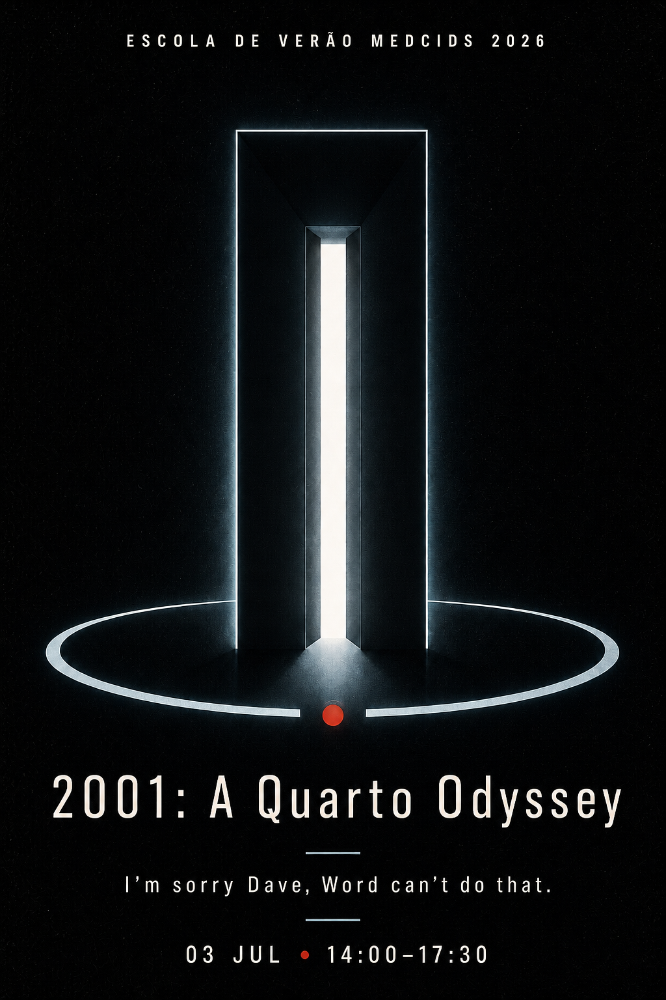

<p align="center">
  
</p>

# 2001: A Quarto Odyssey — Workshop

A course on Quarto, Zotero and R for reproducible research in health. FMUP / MEDCIDS Summer School 2026.

[](https://codespaces.new/tiagojct/quarto-odyssey-lab)

## Getting started

1. Install the tools locally: [R](https://cloud.r-project.org) and [RStudio](https://posit.co/download/rstudio-desktop/); Quarto (bundled with recent RStudio, otherwise [quarto.org/docs/get-started](https://quarto.org/docs/get-started/)); [Zotero 7+](https://www.zotero.org/download/) with [Better BibTeX](https://retorque.re/zotero-better-bibtex/installation/). New to RStudio? See [tiagojct.eu/rsbp](https://tiagojct.eu/rsbp/).
2. Get the materials: `git clone https://github.com/tiagojct/quarto-odyssey-lab.git`, or **Code → Download ZIP**, or **Use this template** to copy it to your own account.
3. Open `quarto-odyssey.Rproj` in RStudio, then install the R packages the exercises need — in the RStudio Console run `source("setup.R")` (or paste `install.packages(c("tidyverse", "gt", "knitr", "rmarkdown"))`). It only installs what's missing.
4. Open `course/course.qmd` and click **Render** (or run `quarto preview course/course.qmd` in the RStudio Terminal). It opens the course in your browser; use the table of contents on the left.
5. When you render a PDF (exercise 3), double-click the rendered `.pdf` in RStudio's **Files** pane to open it in a viewer. The opening slides live in `presentation/slides.qmd` — render them with `quarto preview presentation/slides.qmd` for the local version, or view the [online](https://tiagojct.eu/quarto-odissey/slides/) version directly. They are not required for the exercises, only to follow along with the introduction.

**Fallback: no local install?** The repo ships a `.devcontainer`, so you can open it in **GitHub Codespaces** instead (**Code → Codespaces → Create codespace on main**).

## Structure

```
.
├── quarto-odyssey.Rproj            # RStudio project file
├── setup.R                         # installs the R packages you need
├── course/
│   ├── course.qmd                  # Course document (Quarto HTML)
│   ├── theme.scss                  # Visual theme (poster palette)
│   └── images/                     # Poster and other images
├── presentation/
│   └── slides.qmd                  # Opening slides (Quarto reveal.js)
└── exercises/
    ├── 01-zotero/                  # Zotero library + Better BibTeX (local)
    │   └── starter-files/          # Example PDF + .bib, optional
    ├── 02-quarto-analysis/         # configure a ready-made analysis (local RStudio)
    │   ├── data/cohort-asma.csv
    │   └── template/
    │       ├── manuscript.qmd
    │       ├── references.bib
    │       └── vancouver.csl, nature.csl
    └── 03-writing-export/          # format, cite, and export to .docx/PDF/HTML
```

## Requirements

- R 4.x + RStudio.
- Quarto (bundled with recent RStudio, or installed separately).
- The R packages `tidyverse`, `gt`, `knitr`, `rmarkdown` — install them with `source("setup.R")` (step 3 above).
- Zotero 7+ with Better BibTeX.

All of these run locally. A GitHub account is optional — only needed to clone the repository or use version control.

## Notice

The data provided in exercise 2 is **synthetic**. For your real projects with patient data, see the "Synthetic data and real data" section in [`course/course.qmd`](course/course.qmd) and check your institution's policy.
